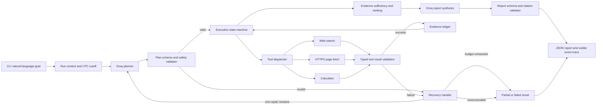

# Architecture

This document defines boundaries and runtime flow, not implementation code. `PROJECT_SPEC.md` is the source of truth for schemas and limits.

## Components and responsibilities

- **CLI/run context:** accepts one natural-language goal, captures run ID and UTC start time, loads configuration, separates JSON output from human-visible events.
- **Planner:** asks the configured Groq model for a concise structured plan. It proposes actions but cannot call tools or advance state.
- **Plan validator:** checks schema, allowlisted tool names, argument schemas, dependencies, step limits, and safety policy. Invalid output is rejected or repaired within the single repair budget.
- **Execution orchestrator/state machine:** sole owner of run state, step status, dependency order, attempt budgets, tool dispatch, and transitions through recovery.
- **Tool adapters:** web search, HTTPS page fetch, calculator. Each validates input, applies time/size limits, normalizes typed results, and returns failures without retrying independently.
- **Recovery handler:** classifies failures, applies bounded retry or one validated plan repair, marks blocked/skipped steps, and records decisions. It cannot bypass validation or call tools itself.
- **Evidence ledger:** stores source metadata, retrieval time, date confidence, source-independence grouping, claim links, and provenance. Search snippets are leads only.
- **Evidence validator/ranker:** verifies report claims against fetched evidence, dates, source support, and independence; selects up to three developments by the stated criteria.
- **Report composer/validator:** synthesizes only from validated evidence, validates versioned schema/references, and sets final status.
- **Event recorder:** emits ordered sanitized events to standard error and includes them in report execution data.

## Data flow

Runtime order is **planner → validator → executor → tools → recovery when needed → evidence validation → report**. Tools return data to the orchestrator; no tool invokes another tool or changes the plan directly.

## State management

The orchestrator is the sole owner of run and step state. Required run states:

`CREATED → PLANNING → PLAN_VALIDATION → READY → RUNNING → EVIDENCE_REVIEW → REPORTING → COMPLETED | PARTIAL | FAILED`

`RECOVERING` is entered only from failed plan validation or execution. It can transition only to `PLANNING` if the one repair remains, `RUNNING` if an eligible retry remains, or `REPORTING` if work is done/no recovery remains. It cannot transition directly to a tool or skip validation. Terminal states cannot transition.

Each step has `PENDING`, `RUNNING`, `SUCCEEDED`, `FAILED`, or `SKIPPED`, an attempt count, dependency IDs, and validated input. Dependencies must succeed before a step starts. A blocked dependent becomes `SKIPPED` with cause. The run context retains immutable original goal/cutoff, validated plan revisions, ordered events, evidence ledger, and remaining budgets.

## Failure handling

Adapters return typed outcomes. The orchestrator records failure, transitions to `RECOVERING`, classifies transient/permanent/invalid-output errors, checks retry/replan budgets, then schedules one allowed action or marks the step failed. Revised plans return through validation. See `FAILURE_MODES.md`.

## Evidence and report flow

Search results are candidates, not proof. Fetch the cited public page, normalize publisher/date, and attach evidence IDs to claims. Prefer a primary source and independently corroborate each reported development with a second fetched source. The validator rejects unsupported claims and unknown citations. If evidence is insufficient, report fewer items or mark them unverified and return an appropriate status.

The report composer receives only goal, validated plan summary, evidence ledger, and failure/limitation summary. Final citations must resolve to the ledger. The report validator checks schema, ranks, status, timestamps, and evidence references before output.
