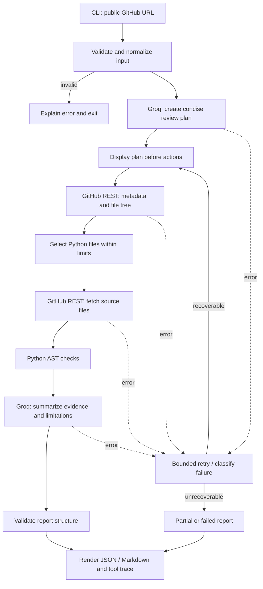

# Architecture

## Components

- **CLI** parses a public GitHub URL and options, validates input, and presents the run trace and final output.
- **Planner/report synthesizer** uses Groq through an environment-configured client. It produces a concise action plan and summarizes evidence already gathered; it does not decide whether tool output is true.
- **GitHub client** retrieves public repository metadata, the recursive file tree, and selected Python files through GitHub's REST API.
- **Python analyzer** applies deterministic AST-based checks to downloaded source in memory. It never imports or executes target code.
- **Orchestrator** runs the plan, records tool outcomes, applies bounded retries where appropriate, and builds the final result.
- **Report renderer** emits the structured JSON contract and an optional readable Markdown view.

## Control flow

## Data flow and boundaries

Only the normalized public repository identifier and retrieved public content flow into the review. Tool results are retained with provenance so findings can cite repository paths and line numbers. The model receives bounded evidence for synthesis; deterministic analysis remains the source of code observations. The orchestrator records concise action summaries, not private model reasoning.

The report follows the contract in `PROJECT_SPEC.md`. Network clients, the Groq client, and the analyzer should be separable so tests can replace them with fakes.

## External interfaces

- **Input:** public GitHub URL plus optional output/failure-demo flags.
- **GitHub:** unauthenticated public REST API requests for repository metadata, tree, and raw file contents; honor response errors and rate-limit information.
- **Groq:** API key and model supplied through environment variables; keep model selection out of source code.
- **Output:** JSON report to standard output or a requested file, with progress and plan on standard error or another clearly separated channel.
