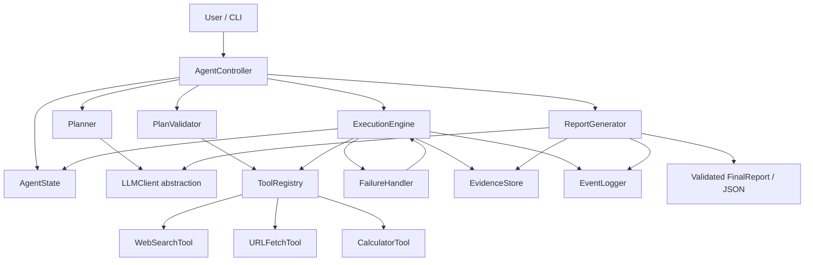

# Technical Architecture

This is the architecture contract for the Autonomous Research Intelligence Agent. It specifies component boundaries, interfaces, state, data models, and deterministic execution policy. Implemented phase scope is tracked in `PROGRESS.md`; the broader functional/report contract remains in `PROJECT_SPEC.md`.

## Architecture principles

- Python CLI, one process, simple modules, no multi-agent framework.
- `AgentController` coordinates one run; `ExecutionEngine` alone owns execution state and policy.
- LLM output is an untrusted proposal. Only validated plans reach the engine; the model never calls tools, chooses recovery actions, or advances state.
- Tool access is through a fixed `ToolRegistry` allowlist. Tools return typed data or typed failures.
- Given the same validated plan, state, tool outcomes, and configuration, the execution policy makes the same ordering, retry, recovery, and terminal-state decisions.
- Visible trace is limited to the goal, structured plan, step statuses, tool calls/outcomes, failure/recovery events, and final result. Do not expose hidden chain-of-thought, full prompts, or model deliberation.

## Components and responsibilities

| Component | Responsibility | Interface contract |
|---|---|---|
| `AgentController` | CLI-facing run coordinator. Constructs `Goal` and `AgentState`, invokes planner/validator/engine/synthesis in order, handles terminal output. Does not directly execute tools. | `run(goal_text: str) -> FinalReport` |
| `Planner` | Requests a structured `Plan` proposal from the LLM using fixed prompt templates, goal, fixed tool descriptions, and bounded recovery context. It parses raw response text into strict `Plan` data and does not decide whether a plan is authorized. | `propose(goal: Goal, context: PlanningContext) -> PlanProposal` |
| `PlanValidator` | Strictly validates schemas, step/dependency limits, tool allowlist and argument schemas, fallback declarations, and plan safety. Produces an approved plan or validation `Failure`. | `validate(goal: Goal, proposal: PlanProposal, state: AgentState, registry: ToolRegistry) -> ValidatedPlan | Failure` |
| `ExecutionEngine` | Sole stateful executor. Selects steps deterministically, checks dependencies and budgets, dispatches calls through registry, updates state/store/events, and delegates all failures to `FailureHandler`. | `execute(plan: ValidatedPlan, state: AgentState) -> AgentState` |
| `AgentState` | Run-local state record: lifecycle state, goal, active plan/version, step statuses, call attempts, budgets, events, evidence IDs, failures, and recovery history. No durable persistence in v1. | Strict model; transitions are applied only by the engine/controller through allowed transition rules. |
| `ToolRegistry` | Registers only the three approved tool names, retrieves by name, exposes input/output schema and timeout metadata, validates arguments/results, and converts dispatch errors to typed `ToolResult`. It cannot be modified by planner/tool output at runtime. | `register(tool)`, `get(name)`, `metadata()`, `validate_arguments(name, args)`, `dispatch(call: ToolCall) -> ToolResult` |
| `WebSearchTool` | Searches through a provider-neutral interface; current isolated Brave adapter returns ordered bounded candidate results with source host and optional publication timestamp. Snippets are discovery leads only. | `execute(call: ToolCall[WebSearchInput]) -> ToolResult[SearchResults]` |
| `URLFetchTool` | Fetches one public HTTPS page with DNS-pinned public-IP connections, no proxy, redirect revalidation, bounded response/text, status and content-type checks, and normalized extraction. | `execute(call: ToolCall[URLFetchInput]) -> ToolResult[FetchedPage]` |
| `CalculatorTool` | Performs the approved Decimal operations or evaluates the restricted arithmetic grammar in `PROJECT_SPEC.md`; it never calls `eval()` or executes code. | `execute(call: ToolCall[CalculatorInput]) -> ToolResult[Calculation]` |
| `FailureHandler` | Deterministically classifies failure and selects one permitted `RecoveryAction` from failure type, step/call history, prevalidated fallback, evidence sufficiency, and remaining budgets. | `recover(failure: Failure, state: AgentState, step: PlanStep) -> RecoveryAction` |
| `EvidenceStore` | Run-local evidence ledger. Adds normalized fetched sources and claim links, deduplicates provenance, resolves IDs, and supplies validated evidence to synthesis. | `add(evidence: Evidence) -> EvidenceId`; `get(evidence_id: EvidenceId) -> Evidence`; `for_goal(goal_id: GoalId) -> list[Evidence]` |
| `EventLogger` | Records sequenced typed events and renders the approved visible trace fields to stderr/report. Redacts secrets and excludes reasoning/prompt content. | `emit(event: ExecutionEvent) -> None` |
| `ReportGenerator` | Requests a concise evidence-grounded summary through `LLMClient`, validates evidence references and `FinalReport`, and selects `COMPLETED`, `PARTIAL`, or `FAILED` under the report policy. | `generate(goal: Goal, plan: Plan, state: AgentState, evidence: list[Evidence]) -> FinalReport` |
| `LLMClient` abstraction | Provider-neutral structured text boundary. The isolated Groq adapter uses its fixed chat-completions endpoint, JSON mode, environment credentials, bounded response size, and a finite timeout. It has no tool registry, callbacks, or function execution. | `generate(operation: LLMOperation, payload: dict, expected_schema: str) -> LLMResponse` |

The table defines logical boundaries. Every tool implements the common `Tool` interface with `name`, `description`, Pydantic `input_schema` and `output_schema`, `timeout_seconds`, and `execute(ToolCall) -> ToolResult`. Implementations preserve the separation between proposals, validation, state transitions, and external side effects. Phase 3 implements planning and proposal validation; Phase 4 implements tool adapters only. The planner does not invoke tools.

`LLMOperation` is an allowlist containing plan proposal, plan revision, and evidence-grounded research summary only. The LLMClient cannot invoke `ToolRegistry` or mutate `AgentState`.

## Component diagram



## Execution sequence

```mermaid
sequenceDiagram
    actor User
    participant AC as AgentController
    participant S as AgentState
    participant P as Planner
    participant L as LLMClient
    participant V as PlanValidator
    participant E as ExecutionEngine
    participant R as ToolRegistry
    participant WS as WebSearchTool
    participant UF as URLFetchTool
    participant C as CalculatorTool
    participant FH as FailureHandler
    participant ES as EvidenceStore
    participant RG as ReportGenerator
    participant EL as EventLogger

    User->>AC: natural-language goal
    AC->>S: create Goal + RECEIVED state
    AC->>EL: run_started(goal)
    AC->>S: transition PLANNING
    AC->>P: propose(goal, bounded context)
    P->>L: structured plan request
    L-->>P: raw structured proposal or Failure
    P-->>AC: PlanProposal
    AC->>S: transition PLAN_VALIDATION
    AC->>V: validate(proposal, registry, state)
    alt invalid proposal
        V-->>AC: validation Failure
        AC->>S: transition RECOVERY
        AC->>FH: classify and choose bounded action
        FH-->>AC: REPLAN or MARK_FAILED
        opt one replan remains
            AC->>P: revised proposal request
            P->>L: structured repair request
            L-->>P: revised proposal
            P-->>AC: PlanProposal
            AC->>V: validate revised proposal
        end
    else valid proposal
        V-->>AC: ValidatedPlan
    end
    AC->>S: transition EXECUTING
    loop each ready step in stable plan order
        AC->>E: execute next step
        E->>R: dispatch validated ToolCall
        alt web search step
            R->>WS: execute(search input)
            WS-->>R: typed ToolResult
        else URL fetch step
            R->>UF: execute(fetch input)
            UF-->>R: typed ToolResult
        else calculator step
            R->>C: execute(calculation input)
            C-->>R: typed ToolResult
        end
        R-->>E: validated ToolResult
        alt tool failure or unmet success criterion
            E->>S: transition RECOVERY + record Failure
            E->>FH: recover(failure, state, step)
            FH-->>E: RETRY / FALLBACK / REPLAN / MARK_FAILED
            E->>EL: failure and recovery events
            opt retry or fallback selected
                E->>R: dispatch one bounded recovery ToolCall
                R-->>E: validated ToolResult
            end
        else success
            E->>ES: store Evidence and provenance
            E->>EL: tool outcome, evidence, step status
        end
    end
    E-->>AC: final execution state
    AC->>S: transition SYNTHESIZING
    AC->>RG: generate(goal, plan, state, evidence)
    RG->>L: evidence-bounded summary request
    L-->>RG: summary draft or Failure
    RG->>RG: validate report schema and evidence IDs
    RG->>EL: report validation and final status
    RG-->>AC: FinalReport
    AC->>S: transition COMPLETED / PARTIAL / FAILED
    AC-->>User: JSON final report; visible trace on stderr
```

## Deterministic execution policy

- Plans contain at most 8 steps. The engine executes sequentially; among currently ready steps, it uses the order declared in the validated plan. No parallel tool execution.
- Tool name and argument schemas come from the immutable registry. Model output cannot register tools, set timeouts, set attempt budgets, change status, or select a recovery action.
- PlanValidator constrains search date bounds to the normalized Goal window and run-start time. URLFetchTool receives URLs from the goal or prior validated search results only; runtime redirects are independently checked by URL safety policy.
- The engine owns call IDs, attempt numbers, step states, lifecycle transitions, and event sequence numbers.
- Fixed limits: 8 plan steps, 20 total execution/tool invocations per run including retries/fallbacks, 2 total attempts per logical tool step (initial call plus at most one retry or fallback), 2 attempts per model operation, and at most one validated-plan revision per run. A malformed structured response may use the model operation's second attempt before any Plan has been validated; this is separate from a later runtime replan. Revision never resets any budget. A replacement step inherits its logical predecessor's attempt count; changing a step ID cannot create a fresh budget.
- Every repeated or fallback call consumes the same per-step attempt budget. A fallback is the second attempt, not a third attempt after retry.
- With identical validated plan, state, tool results, and configuration, step ordering and recovery choice are identical. LLM-generated plan/summary text may vary but cannot change execution policy.

## Lifecycle and state machine

### States

- `RECEIVED`: goal/config have been accepted and run context created.
- `PLANNING`: Planner requests a structured plan proposal.
- `PLAN_VALIDATION`: PlanValidator checks the proposal or revised plan.
- `EXECUTING`: ExecutionEngine dispatches ready, validated steps and records outcomes.
- `RECOVERY`: FailureHandler selects a single permitted action using the deterministic policy and remaining budgets.
- `SYNTHESIZING`: ReportGenerator builds and validates the evidence-grounded final report.
- Terminal states: `COMPLETED` (goal requirements met), `PARTIAL` (useful report, some requested research/evidence incomplete), `FAILED` (no trustworthy report can be produced).

### Allowed transitions

Normal path:

`RECEIVED → PLANNING → PLAN_VALIDATION → EXECUTING → SYNTHESIZING → COMPLETED`

Failure/recovery paths:

- `RECEIVED → FAILED` for invalid goal or fatal configuration before planning.
- `PLANNING → RECOVERY` for a retryable or malformed LLM response; `RECOVERY → PLANNING` only while model-attempt/plan-revision budgets allow.
- `PLAN_VALIDATION → RECOVERY` for an invalid plan; `RECOVERY → PLANNING` for the single repair, otherwise `RECOVERY → FAILED`.
- `EXECUTING → RECOVERY` on tool failure or an unmet step success criterion.
- `RECOVERY → EXECUTING` for the selected retry/fallback; `RECOVERY → PLANNING` for the one allowed validated plan revision; `RECOVERY → SYNTHESIZING` to report partial work; `RECOVERY → FAILED` when no useful evidence/report is possible.
- `SYNTHESIZING → RECOVERY` only for a recoverable LLM/report-validation failure within its model-operation limit; `RECOVERY → SYNTHESIZING` for one permitted retry/repair.
- `SYNTHESIZING → COMPLETED | PARTIAL | FAILED` according to report status rules.

No other transitions are valid. `COMPLETED`, `PARTIAL`, and `FAILED` are terminal. All state changes are validated and emitted as events; tools and the LLM cannot change state.

### Failed-step recovery policy

The FailureHandler applies this order; the model may not select the action:

1. **Retry:** For transient timeout, connection error, HTTP 5xx, or temporary 429, repeat the same validated call once if the step and run budgets permit. Do not alter arguments during a retry.
2. **Fallback:** If a retry was not selected for the first attempt, use the step's one predeclared, PlanValidator-approved fallback when the failure category is explicitly fallback-eligible. Examples: another search query for empty results; another URL candidate already returned by search for a page-specific fetch failure. A fallback consumes the step's remaining attempt; it is not followed by another retry. A transient call that already used its retry has no attempt left for fallback.
3. **Replan:** If a semantic/coverage failure remains recoverable, the failed logical step has an attempt slot left, and the single validated-plan revision allowance remains, ask Planner for a replacement of unresolved work only. Validate the new plan; preserve completed work and all attempt/call budgets. A replacement step carries `recovery_of_step_id` and inherits the failed step's attempt count. Replanning does not authorize unsafe tools or repeat completed steps.
4. **Permanently fail:** Mark the step `FAILED` when failure is non-retryable and no approved fallback/replan applies, a budget is exhausted, or repair validation fails. Mark dependent steps `SKIPPED`; continue independent work if useful, then return `PARTIAL` or `FAILED`.

Failure classification:

- **Retryable:** timeout, connection reset, temporary 5xx, 429 with provider retry guidance within budget, and malformed provider response that may be transient. Model operations follow the separate two-attempt cap.
- **Not retryable as the same call:** invalid goal/arguments, unknown tool, unsafe URL/redirect, 404 or other permanent 4xx, authentication/configuration error, deterministic calculator input/division error, unsupported content/policy block, and a valid empty result.
- Empty search or insufficient evidence is a semantic failure, not a transport retry. It may use a validated fallback query or trigger the one replan; otherwise the report discloses the evidence gap.
- **Fallback-eligible:** empty search results (use the prevalidated alternate query); page-specific 404/410 or unsupported page content (use another URL already returned by search); insufficient evidence (use a prevalidated alternate search query). Auth/config failures, unsafe destinations, invalid arguments, and global provider access failures have no fallback. Calculator errors are not auto-corrected; omit the dependent calculation unless a distinct valid calculation was explicitly planned.
- Security-policy failures never fall back to the blocked URL. A safe alternate must independently pass URL validation.

## Structured data-model summary

All boundary data uses strict Pydantic models (strict type coercion, unknown fields forbidden, field and cross-field validation). Raw JSON from a model or tool is never treated as a trusted model instance before validation. Tool bounds are centralized in `research_agent.limits` and recorded in `DECISIONS.md`.

### `Goal`

`{goal_id: UUID, text: non-empty str, requested_window: {start: UTC datetime, end: UTC datetime} | null, run_started_at: UTC datetime}`. `requested_window` is normalized once against `run_started_at`; if omitted, the existing seven-day default applies.

### `Plan`

`{plan_id: UUID, goal_id: UUID, revision: int >= 1, steps: list[PlanStep] (1..8), replaces_plan_id: UUID | null}`. Extra fields are rejected; no free-form reasoning field exists.

### `PlanStep`

`PlanStep` validates the planner-facing fields `{id, objective, tool_name, input, expected_output, dependencies, status}` plus optional fallback/recovery metadata. `status` must be `PENDING` in a new proposal. `input` is one of the approved tool argument schemas. Internally, report serialization uses the compatible names `{step_id, description, tool_name, arguments, success_criteria, depends_on, status}`. IDs are unique, dependencies refer to other plan steps, and the graph is acyclic. `ToolCallTemplate` contains only `{tool_name, arguments}`; the engine supplies identity/attempt metadata. A replacement step records the failed logical step it continues and shares its attempt count.

### `ToolCall`

`{call_id: UUID, run_id: UUID, step_id: str, tool_name: ToolName, arguments: validated tool-specific input model, attempt: 1..2, kind: primary | retry | fallback}`. `tool_name` selects only one of the three fixed schemas; mismatched arguments fail validation. Engine supplies identity/attempt/kind; planner only proposes step input and tool name.

### `ToolResult`

`{call_id: UUID, status: succeeded | failed, output: SearchResults | FetchedPage | Calculation | null, failure: Failure | null, started_at: UTC datetime, finished_at: UTC datetime}`. Cross-validation requires output on success and failure on failure.

### Search and fetch outputs

`SearchResults` contains ordered results `{title, url, snippet, source, published_at?}` plus safe provider metadata. `source` is the normalized hostname; search snippets remain discovery-only. `FetchedPage` contains final URL, validated 2xx status, title, publisher host, optional UTC publication time, extracted text up to 20,000 characters, retrieval time, and a truncation flag. Search requests are capped at 10 results and 1 MB; page fetch is capped at 1 MB and five redirects.

### Calculator boundary

Calculator input is either an allowlisted Decimal operation with operands or a restricted expression of decimal literals, parentheses, unary signs, and `+ - * /`. Expression size is limited to 256 characters and 64 AST nodes. The parser recursively handles only explicit AST node types; it never evaluates arbitrary Python.

### `Evidence`

`{evidence_id: UUID, source_url: canonical public HTTPS URL, title: str, publisher: str | null, source_type: primary | independent_secondary | other, source_group_id: str, published_at: UTC datetime | null, retrieved_at: UTC datetime, supporting_text: bounded str, supports: list[str], verification: candidate | verified | contradictory}`. Search snippets alone cannot become `verified` evidence; source references and date claims are validated before report use. `supports` contains stable development/claim identifiers used by the report contract.

### `ExecutionEvent`

`{event_id: UUID, run_id: UUID, sequence: positive int, timestamp: UTC datetime, event_type: RunEventType, state: RunState, step_id: str | null, call_id: UUID | null, attempt: int | null, outcome: started | succeeded | failed | rejected | scheduled | skipped | recovered | completed, summary: sanitized bounded str}`. `RunEventType` is restricted to the observable events in `PROJECT_SPEC.md`; lifecycle transitions are captured on those events' `state` field. Event sequence is strictly increasing per run.

### `Failure`

`{failure_id: UUID, category: timeout | rate_limit | server_error | invalid_response | invalid_argument | not_found | auth_config | unsafe_url | empty_results | insufficient_evidence | calculator_error | state_invariant | synthesis_invalid | retry_exhausted | llm_error, origin: planner | validator | llm | tool | executor | evidence | report, retryability: retryable | non_retryable | semantic, run_id: UUID, step_id: str | null, call_id: UUID | null, message: sanitized str, occurred_at: UTC datetime}`. Retryability is assigned by FailureHandler, never by a remote tool/model.

### `RecoveryAction`

`{action_id: UUID, failure_id: UUID, kind: retry | fallback | replan | mark_failed | skip_dependent | continue_partial, target_step_id: str | null, replacement_call: ToolCall | null, reason_code: transient | empty_results | insufficient_evidence | invalid_output | permanent_error | budget_exhausted, selected_at: UTC datetime}`. Only FailureHandler can create it; the reason is a concise policy code, not hidden reasoning.

### `FinalReport`

Strict version-1 model: `{schema_version: "1.0", run_id: UUID, status: completed | partial | failed, goal: non-empty str, run_started_at: UTC datetime, run_finished_at: UTC datetime, research_brief: ResearchBrief, sources: list[SourceCitation], plan: Plan, execution: ExecutionSummary, failures: list[Failure], limitations: list[str]}`. `ResearchBrief` contains `topic`, UTC window bounds, `summary`, 0–3 ranked developments (`development_id`, `rank: 1..3`, `title`, `published_at`, `description`, `relevance`, `comparison_note`, `confidence: float in [0,1]`, `evidence_ids`), `comparison`, and `conclusion`. `SourceCitation` is the report-safe projection of `Evidence`: `evidence_id`, URL, title, publisher, source type, publication/retrieval time, and `supports`; it omits internal supporting text. `ExecutionSummary` contains ordered `ExecutionEvent`s, tool-call summaries, retry counts, and recovery actions. Every cited evidence ID must resolve; status must match fulfilled requirements and unresolved failures.

`AgentState` contains `{run_id, run_state, goal, active_plan, step_statuses, call_history, per_step_attempts, tool_calls_used (0..20), model_attempts_by_operation, plan_revision_used (bool), failures, recovery_actions, event_sequence, evidence_ids}`. It is run-local and in-memory in v1; a plan revision does not reset counters.

## Phase 1 acceptance criteria

- All fourteen requested components have one responsibility and a defined interface; `ExecutionEngine` is the sole owner of stateful execution policy.
- The component and sequence diagrams show planner, validator, executor, tools, recovery, evidence, and report flow, including failure paths.
- All ten requested data models have typed required fields, bounds, enums, and cross-field validation expectations.
- Every valid lifecycle transition, recovery route, and terminal state is documented; invalid transitions are rejected.
- Retry, fallback, replan, and permanent-failure rules agree with the hard limits in `PROJECT_SPEC.md` and `FAILURE_MODES.md`.
- Model, deterministic application, and external-tool boundaries are explicit; visible trace excludes hidden reasoning.
- No application code, dependencies, or external API calls are part of this architecture phase.

## Model, application, and tool boundaries

- **Model-generated:** proposed plan steps/descriptions/arguments, optional fallback proposal, and concise research-summary wording grounded in supplied evidence IDs. The model does not set final status; application policy derives it.
- **Deterministic application logic:** schema validation, allowlist, URL safety, date normalization, state transitions, step order, budgets, failure classification, retry/fallback/replan choice, evidence-ID checks, report status, and output serialization.
- **External tool execution:** only `ToolRegistry` dispatches to the three fixed tool adapters. The adapters validate inputs, enforce limits, normalize outputs, and return typed failures. Calculator is deterministic local arithmetic; search/fetch are external network calls.
- The LLMClient is a text/structured-response boundary only: no function calling, tool registry, callbacks, arbitrary code, or state mutation.
- User-visible trace includes only: goal; structured plan; step statuses; tool calls; tool outcomes; failure/recovery events; final result. It excludes model prompts, hidden reasoning, and raw untrusted page payloads.
